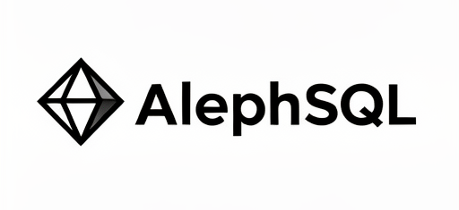

## AlephSQL - C++ 20
###
A high-performance asynchronous SQL C++ library that natively supports Linux and is compatible with Windows
###




##
  Currently supporting MySQL, but SQLite is already available, so future database support won't affect the SQLite module.
##

##
  Dependency list
  <div style="display: flex; flex-direction: column; gap: 4px;">
    <span>MySQL: YES</span>
    <span>SQLite: YES</span>
    <span>PostgreSQL: WAIT</span>
  </div>

  <span>
    Future dependencies are expected to support many databases, but keep in mind that just because this library 
    supports them doesn't mean you need to download all of them.
  </span>

  ###
##

##
  Installation Guide
  ###
    1.Before compiling, you need to copy the 'include/' directory to your system's header file directory, otherwise 
    it won't find the header files and the compilation will fail.
  ###
  ###
    2.After finishing the header file transfer and making sure your database dependencies are correct, create a build directory in the terminal again, go into this 
    directory, run 'make', and wait for the compilation to finish.
  ###
  ###
    3.If everything is normal, you just need to run the install command to complete the installation 
    (CMake install command varies depending on the system).
  ###

  ###
    PROMPT:
    If your installation fails, please let me know about the problem in the GitHub repository discussion section,and I will fix it and submit the corrected code.
  ###
##

##
  Sqlite sample code [synchronous]
  ```cpp
#include <aleph/aleph_sql.hpp>
#include <iostream>
#include <ostream>

int main(int argc, char* argv[]) {
  /** 
  Create a Sqlite object, note that only shared smart pointers are allowed because asynchronous operations need synchronization, it can only be trapped by this design requirement.
  */
  aleph::sqlite3_ptr new_sqlite3 = aleph::sql_database::create_sql<aleph::sql_type::SQLITE>();
  /**
    When using this pointer object to call the SQLite file open function
  */
  new_sqlite3->open_sqlite_database("test.db");
  /** 
  If everything works fine when opened, call the execution function again. The execution functions are divided into 'Select' and normal execution. 
  @Select function | This type is used to execute statements that can return data.
  @Basic function | This type of function is mainly used to execute statements that check status.
  In the future, I will distinguish all public functions in the documentation.
  */
    aleph::sqlite_execute_result sqlite_add_result = 
      //It internally calls bound functions, so you don't need to worry about SQL injection issues.
      new_sqlite3->execute_sqlite(
        "INSERT INTO test (name, age) VALUES (?, ?)",
          argv[1] , argv[2]);
        /**
        After the function finishes executing, it will return a structure that lets you check the execution status: 'true' means success, and 'false' means failure.
        */
        if (sqlite_add_result.sqlite3_execute_status) {
        
          std::cerr << "Insert success name:'" << argv[1] << "' age :" 
            << argv[2] << " change : " << sqlite_add_result.sqlite3_affected_row 
              << " line" << std::endl;
        } else {  
          /** 
            After a failure, you can determine the current problem from the error message and error code.
          */
          if (sqlite_add_result.sqlite3_execute_error_code == SQL_UNIQUE_CONSTRAINT_FAILED) {
            std::cerr << "Insert name '" << argv[1] << "' failed already exists" << std::endl;
            //Continue query
          } else {
            std::cerr << "Update failed error: " 
              << sqlite_add_result.sqlite3_execute_error << std::endl;
            return -1;
          }
        }
      /** 
        Now call a 'Select' execution function to query the username
      /
      aleph::sqlite_execute_result sqlite_query_result = 
        new_sqlite3->execute_sqlite_select(
        "SELECT id , name , age FROM test WHERE name = ?"
        , argv[1] );
        //If the query result isn't empty, it means the person actually exists in the database.
        if (sqlite_query_result.sqlite3_execute_error.empty() || 
            sqlite_query_result.sqlite3_execute_status) {
          if (sqlite_query_result.sqlite3_result_row.empty()) {
            /** 
              If the query result isn't empty, it means the person actually exists in the database.
            */
            std::cout << "Not found '" << argv[1] << "' " << std::endl;
            return -1;
          }
          /** 
            If everything checks out fine, you can start using a loop to get 'row' and read the information in the order 'SELECT id, name, ...'. You can get it from your statement like
            'row[0]' which is the 'id' field, and 'row[1]' which is the 'name' field.
          */
          for (const auto& row : sqlite_query_result.sqlite3_result_row) {
            std::cout << "Query success id: " << row[0]  << " / name: " << row[1]  << "/ age: " << row[2] << std::endl;
          }
          return 0;
        } else {
          /** 
            If it not only has no information but also fails,
            you can directly print or handle the error message for debugging.
          */
          std::cout << "Error: " << sqlite_query_result.sqlite3_execute_error << std::endl;
          return -1;
        }
    return 0;
}
```

##
  For asynchronous operations and more detailed advanced asynchronous operations, please be patient while the documentation is being completed. You can directly 
  start using synchronous operations for small SQLite software development, 
  of course, it would be even better if more developers could make changes and add support.
##

##